## 访问 Linux 文件系统

### 存储管理概念

红帽企业 Linux (RHEL) 使用 XFS 作为默认的本地文件系统。RHEL 还支持使用 ext4 文件系统来管理本地文件。自 RHEL9 起，支持将 exFAT 文件系统用于可移动介质。在企业服务器集群中，共享磁盘使用全局文件系统 2(GFS2) 文件系统来管理并发多节点访问。

### 文件系统和挂载点

将文件系统挂载到空目录后就可以访问文件系统的内容。该目录被称为挂载点。

### 文件系统、存储和块设备

块设备是提供存储设备低级别访问权限的文件。必须对块设备进行可选分区， 并创建文件系统，然后才能挂载该设备。

/dev 目录存储 RHEL 自动为所有设备创建的块设备文件。在 RHEL 9 中，检测到的第一个 SATA、SAS、SCSI 或 USB 硬盘驱动器设备背称为 /dev/sda 设备，第二个被称为 /dev/sdb 设备，以此类推。这些名称代表整个硬盘驱动器。

#### 块设备命名

| 设备类型                            | 设备命名模式                    |
| ----------------------------------- | ------------------------------- |
| SATA/SAS/USB 附加存储 (SCSI 驱动器) | /dev/sda、/dev/sdb、/dev/sdc··· |
| virtio-blk 半虚拟化存储 (VM)        | /dev/vda、/dev/vdb、/dev/vdc··· |
| virtio-scsi 半虚拟化存储 (VM)       | /dev/sda、/dev/sdb、/dev/sdc··· |
| NVMe 附加存储 (SSD)                 | /dev/nvme0、/dev/nvme1···       |
| SD/MMC/eMMC 存储 (SD 卡)            | /dev/mmcblk0、/dev/mmcblk1···   |

### 磁盘分区

通常，不会将整个存储设备创建成一个文件系统。若要创建分区，请将存储设备划分为较小的区块。

借助分区，可以划分硬盘：不同部分可以通过不同的文件系统进行格式化或用于其他用途。例如，一个分区可以包含用户主目录，另一个分区则可包含系统数据和日志。即使主目录分区被填满了数据，系统分区可能依然有可用的空间。

分区本身就是块设备。以 SATA 附加存储为例，第一分区是 /dev/sda1 磁盘。同一存储的第二分区是 /dev/sda2 磁盘。第三 SATA 附加存储设备上的第三个分区是 /dev/sdc3 磁盘，以此类推。半虚拟化存储设备也采用类似的命名体系。即/dev/vda1、/dev/vdb1.

NVMe 附加 SSD 设备命名的方式与 SATA 不同。对于NVMe 存储设备，名称的 nvmeX 部分指代设备，nY 部分指代命名空间，而 pZ 部分则指代分区。例如，第一磁盘上第一命名空间的第一分区是 /dev/nvme0n1p1 分区。第二磁盘上第一命名空间的第三分区是 /dev/nvme1n1p3 分区，以此类推。

SD 或 MMC 卡有时具有与 SATA 设备类似的命名系统 (/dev/sdN)，但并非总是如此。在某些情况下，SD 或 MMC 卡可能具有诸如 /dev/mmcblk0p1 之类的名称，其中名称的 mmcblkX 部分指代存储设备，名称的 pY 部分则指代该设备上的分区编号。

host 计算机上 /dev/sda1 设备文件的扩展列表显示了 b 文件类型，其代表块设备：

```bash
[root@redhat ~]# ls -l /dev/nvme0
crw-------. 1 root root 241, 0 Feb  8 22:56 /dev/nvme0
[root@redhat ~]# ls -l /dev/nvme0n1
brw-rw----. 1 root disk 259, 0 Feb  8 22:56 /dev/nvme0n1
[root@redhat ~]# ls -l /dev/nvme0n1p3
brw-rw----. 1 root disk 259, 3 Feb  8 22:56 /dev/nvme0n1p3
```

### 逻辑卷

整理磁盘和分区的另一种方式是利用逻辑卷管理 (LVM)。借助 LVM，可以将多个块设备聚合到一个卷组中。卷组中的磁盘空间分割成若干逻辑卷，他们的功能等同于物理磁盘上的分区。

LVM 系统在创建时为卷组和逻辑卷分配名称。LVM 在 /dev 目录中创建一个名称与组名匹配的目录，然后再该新目录中创建一个与逻辑卷同名的符号链接。之后，可以挂载该逻辑卷文件。例如，如果存在一个 myvg 卷组和 mylv 逻辑卷，那么其逻辑卷的完整路径名是 /dev/myvg/mylv。

> 上明提到的逻辑卷设备名称建立了实际设备文件的符号链接，以此来访问该文件，其名称在每次启动时可能会有所不同。还有一种逻辑卷设备命名形式，那就是与常用的 /dev/mapper 中的文件建立链接，通常用于指向实际设备文件的符号链接。

### 检查文件系统

```bash
[root@redhat ~]# df -Th
Filesystem     Type      Size  Used Avail Use% Mounted on
devtmpfs       devtmpfs  4.0M     0  4.0M   0% /dev
tmpfs          tmpfs     3.8G     0  3.8G   0% /dev/shm
tmpfs          tmpfs     1.5G  9.1M  1.5G   1% /run
/dev/nvme0n1p3 xfs        98G  2.1G   96G   3% /
/dev/nvme0n1p2 xfs       960M  208M  753M  22% /boot
/dev/nvme0n1p1 vfat     1022M  7.0M 1016M   1% /boot/efi
tmpfs          tmpfs     765M     0  765M   0% /run/user/0
```

分区显示在 `/` 和 `/boot` 目录中挂载了两个物理文件系统，`tmpfs` 和 `devtmpfs` 设备是系统内存中的文件系统。系统重启后，写入到 tmpfs 或 devtmpfs 文件系统的所有文件都会消失。

`du` 命令可以查看某个目录的大小

```bash
[root@redhat ~]# du -sh /etc/
23M     /etc/

[root@redhat ~]# du -h .
0       ./.ssh
4.0K    ./bak
0       ./.ansible/tmp
0       ./.ansible
36K     .
```

### 挂载和卸载文件系统

#### 识别块设备

```bash
[root@redhat ~]# lsblk
NAME        MAJ:MIN RM  SIZE RO TYPE MOUNTPOINTS
sr0          11:0    1  9.8G  0 rom
nvme0n1     259:0    0  100G  0 disk
├─nvme0n1p1 259:1    0    1G  0 part /boot/efi
├─nvme0n1p2 259:2    0    1G  0 part /boot
└─nvme0n1p3 259:3    0   98G  0 part /
nvme0n2     259:4    0  100G  0 disk
└─nvme0n2p1 259:5    0   20G  0 part
```

#### 查看硬盘 UUID

```bash
[root@redhat ~]# blkid /dev/nvme0n2p1
/dev/nvme0n2p1: UUID="7546d64b-3987-439c-8d83-40ad8a51a6c5" TYPE="xfs" PARTUUID="7d8eed58-01"
```

#### 使用 mount 临时挂载

```bash
[root@redhat ~]# mount UUID="7546d64b-3987-439c-8d83-40ad8a51a6c5" /mnt/data/
```

#### 自动挂载可移动存储设备

使用图形桌面环境时，系统会在检测到可移动存储介质时自动挂载该介质。

可移动存储设备挂载到 /run/media/USERNAME/LABEL 位置。USERNAME 是登录图形环境的用户的名称。LABEL 是标识符，通常是存储介质上的标签。

要安全的分离可移动设备，请先手动卸载设备上的所有文件系统。

#### 卸载文件系统

系统关机和重新启动过程中会自动卸载所有文件系统。所有文件系统数据将清空到存储设备，以确保文件系统数据的完整性。

> 文件系统数据在正常操作期间使用内存缓存。在拔下驱动器之前，必须先卸载可移动驱动器的文件系统。卸载过程会将数据写入到磁盘，然后释放驱动器。

`umount` 命令使用挂载点为参数，以卸载文件系统。

```bash
[root@redhat ~]# umount /mnt/data
```

如果挂载的文件系统在使用之中，则无法卸载。要成功执行 umount 命令，所有进程都必须停止访问挂载点以下的数据。

在以下示例中，umount 命令将失败，因为 shell 将 /mnt/data 目录用作当前的工作目录，因而会生成错误消息。

```bash
[root@redhat ~]# cd /mnt/data/
[root@redhat data]# umount /mnt/data
umount: /mnt/data: target is busy.
```

`lsof` 命令可列出所有打开的文件，以及访问该文件系统的进程。此列表可以帮助识别哪些进程正在阻止文件系统被成功卸载。

```bash
[root@redhat data]# lsof /mnt/data/
COMMAND  PID USER   FD   TYPE DEVICE SIZE/OFF NODE NAME
bash    1230 root  cwd    DIR  259,5        6  128 /mnt/data
lsof    1786 root  cwd    DIR  259,5        6  128 /mnt/data
lsof    1787 root  cwd    DIR  259,5        6  128 /mnt/data
```

在识别进程后，等待进程完成或发送 SIGTERM 或 SIGKILL 信号来终止它们。在示例中，只需将当前工作目录更改为挂载点之外的目录便可。

```bash
[root@redhat data]# cd
[root@redhat ~]# umount /mnt/data
```

## 通过名称查找文件

### locate

`locate` 命令根据文件的名称或路径来搜索文件。此命令速度较快，因为他是从 `mlocate` 数据库中查找这些信息的。但是，此数据库不会实时更新，需要频繁更新才能获得准确结果。此功能还意味着 locate 命令不会搜索上次数据库更新后创建的文件。

locate 数据库会每日自动更新。不过，root 用户可在通过发出 updatedb 命令来强制即刻更新。

```bash
[root@redhat ~]# updatedb
```

locate 命令限制非特权用户的结果。若要查看生成的文件名，用户必须对文件所在的目录具有搜索权限。例如，查找 redhat 用户可以读取且名称或路径中与 passwd 关键字匹配的文件：

```bash
[redhat@redhat ~]$ locate passwd | head
/etc/passwd
/etc/passwd-
/etc/pam.d/passwd
/etc/security/opasswd
/usr/bin/gpasswd
/usr/bin/grub2-mkpasswd-pbkdf2
/usr/bin/passwd
/usr/lib/firewalld/services/kpasswd.xml
/usr/lib64/security/pam_unix_passwd.so
/usr/sbin/chgpasswd
```

locate 命令 `-i` 选项执行不区分大小写的搜索。此选项返回匹配的大写和小写字母的所有可能组合：

```bash
[redhat@redhat ~]$ locate -i messages | head
/usr/lib/locale/C.utf8/LC_MESSAGES
/usr/lib/locale/C.utf8/LC_MESSAGES/SYS_LC_MESSAGES
/usr/lib/locale/en_AG/LC_MESSAGES
/usr/lib/locale/en_AG/LC_MESSAGES/SYS_LC_MESSAGES
/usr/lib/locale/en_AU/LC_MESSAGES
/usr/lib/locale/en_AU/LC_MESSAGES/SYS_LC_MESSAGES
/usr/lib/locale/en_AU.utf8/LC_MESSAGES
/usr/lib/locale/en_AU.utf8/LC_MESSAGES/SYS_LC_MESSAGES
/usr/lib/locale/en_BW/LC_MESSAGES
/usr/lib/locale/en_BW/LC_MESSAGES/SYS_LC_MESSAGES
```

locate 命令 `-n` 选项可限制返回的搜索结果数。以下示例将 locate 命令返回的搜索结果限制为前五个匹配项：

```bash
[redhat@redhat ~]$ locate -n 5 passwd
/etc/passwd
/etc/passwd-
/etc/pam.d/passwd
/etc/security/opasswd
/usr/bin/gpasswd
```

### find

find 命令通过在文件系统层次结构中执行实时搜索来查找文件。此命令速度比 locate 命令慢，但更加准确。此外，find 命令还可以根据文件名以外的条件搜索文件，例如文件的权限、文件大小或修改时间。

find 命令使用执行搜索的用户账户查看文件系统中的文件。运行 find 命令的用户必须具有要查看其内容的读取和执行权限。

find 命令的第一个参数是要搜索的目录。如果 find 命令省略了目录参数，它会从当前目录中开始搜索，并在任何目录中查找匹配项。

要按文件名搜索文件，请使用 find 命令 `-name FILENAME` 选项来返回与 FILENAME 完全匹配的文件路径。例如，若要根据根 / 目录的 sshd_config 文件，可运行以下命令：

```bash
[root@redhat ~]# find / -name sshd_config
/etc/ssh/sshd_config
```

> 在 find 命令中，完整词语选项使用单个短划线表示选项，这与大多数其他 Linux 命令的双短划线不同。

可以使用通配符搜索文件名，并返回部分匹配的所有结果。使用通配符时，请务必将要查找的文件名用引号括起，以防止终端对通配符进行错误解读。

```bash
[root@redhat ~]# find / -name '*.txt' | head
/etc/pki/nssdb/pkcs11.txt
/etc/sysconfig/network-scripts/readme-ifcfg-rh.txt
/usr/lib/python3.9/site-packages/setuptools-53.0.0.dist-info/dependency_links.txt
/usr/lib/python3.9/site-packages/setuptools-53.0.0.dist-info/entry_points.txt
/usr/lib/python3.9/site-packages/setuptools-53.0.0.dist-info/top_level.txt
/usr/lib/python3.9/site-packages/six-1.15.0.dist-info/top_level.txt
/usr/lib/python3.9/site-packages/python_dateutil-2.8.1-py3.9.egg-info/SOURCES.txt
/usr/lib/python3.9/site-packages/python_dateutil-2.8.1-py3.9.egg-info/dependency_links.txt
/usr/lib/python3.9/site-packages/python_dateutil-2.8.1-py3.9.egg-info/requires.txt
/usr/lib/python3.9/site-packages/python_dateutil-2.8.1-py3.9.egg-info/top_level.txt
```

若要在 /etc 目录中搜索含有 pass 字符串的文件，可运行以下命令：

```bash
[root@redhat ~]# find /etc/ -name '*pass*'
/etc/passwd
/etc/security/opasswd
/etc/pam.d/password-auth
/etc/pam.d/passwd
/etc/passwd-
```

要对文件名执行不区分大小写的搜索，可使用 find 命令 `-iname` 选项，后面加上要搜索的文件名。若要使用不区分大小写文本匹配，在根 / 目录中搜索名称中含有 messages 字符串的文件，可运行以下命令：

```bash
[root@redhat ~]# find / -iname '*messages*' | head
/sys/power/pm_debug_messages
/sys/module/libahci/parameters/ahci_em_messages
/var/log/messages
/usr/lib/locale/en_AG/LC_MESSAGES
/usr/lib/locale/en_AG/LC_MESSAGES/SYS_LC_MESSAGES
/usr/lib/locale/en_AU/LC_MESSAGES
/usr/lib/locale/en_AU/LC_MESSAGES/SYS_LC_MESSAGES
/usr/lib/locale/en_AU.utf8/LC_MESSAGES
/usr/lib/locale/en_AU.utf8/LC_MESSAGES/SYS_LC_MESSAGES
/usr/lib/locale/en_BW/LC_MESSAGES
```

#### 根据所有权或权限搜索文件

find 命令可以根据所有权或权限搜索文件。find 命令的 `-user` 和 `-group` 选项按用户和组名称进行搜索，或按用户 ID 和组 ID 进行搜索。

在 /home/redhat 目录中搜索 redhat 用户拥有的文件：

```bash
[root@redhat ~]# find /home/redhat/ -user redhat
/home/redhat/
/home/redhat/.bash_logout
/home/redhat/.bash_profile
/home/redhat/.bashrc
/home/redhat/.bash_history
```

在 /home/redhat 目录中搜索 redhat 组拥有的文件：

```bash
[root@redhat ~]# find /home/redhat/ -group redhat
/home/redhat/
/home/redhat/.bash_logout
/home/redhat/.bash_profile
/home/redhat/.bashrc
/home/redhat/.bash_history
```

在 /home/redhat 目录中搜索 1000 用户 ID 拥有的文件：

```bash
[root@redhat ~]# find /home/redhat/ -uid 1000
/home/redhat/
/home/redhat/.bash_logout
/home/redhat/.bash_profile
/home/redhat/.bashrc
/home/redhat/.bash_history
```

在 /home/redhat 目录中搜索 1000 组 ID 拥有的文件：

```bash
[root@redhat ~]# find /home/redhat/ -gid 1000
/home/redhat/
/home/redhat/.bash_logout
/home/redhat/.bash_profile
/home/redhat/.bashrc
/home/redhat/.bash_history
```

find 命令 `-perm` 选项可查找具有特定权限集的文件。八进制值使用4、2 和 1 定义读取、写入和执行权限。权限前面带有 / 或 - 符号，以控制搜索结果。

八进制权限前面带有 / 符号或将匹配权限集中至少为用户、组或其他人设置了至少一个权限的文件。具有 `r--r--r--` 权限的文件与 `/222` 权限不匹配，但与 `rw-r--r--` 权限匹配。权限前带有 - 符号表示权限的所有三个部分都必须匹配。对于上一示例，具有 `rw-rw-rw-` 权限的文件将符合条件。您还可以使用 find 命令 `-perm` 选项，与符号法表示的设置搭配。

```bash
#精确匹配，直接写权限
[root@redhat ~]# find /etc/ -perm 700 -ls
 67409936      0 drwx------   2 root     root            6 Jul 31  2023 /etc/pki/rsyslog
202109962      0 drwx------   2 root     root           59 Feb  8 22:53 /etc/ssh/sshd_config.d
134696963      0 drwx------   2 polkitd  root           65 Feb  8 22:49 /etc/polkit-1/rules.d
134361986      0 drwx------   3 root     root           66 Feb  8 22:49 /etc/nftables
201461406      0 drwx------   2 root     root           19 Feb  8 22:49 /etc/nftables/osf
134427617      4 drwx------   2 root     root         4096 Feb  8 22:50 /etc/grub.d
202207781      0 drwx------   4 sssd     sssd           31 Feb  8 22:50 /etc/sssd

[root@redhat ~]# find /etc/ -perm u=rw,g=r,o=r -ls | head
134348931      4 -rw-r--r--   1 root     root          608 Feb  8 22:48 /etc/fstab
134348933      4 -rw-r--r--   1 root     root           73 Feb 10 18:18 /etc/resolv.conf
      630      4 -rw-r--r--   1 root     root          108 Sep  9  2022 /etc/dnf/dnf.conf
 67298856      4 -rw-r--r--   1 root     root          351 Sep  9  2022 /etc/dnf/plugins/copr.conf
 67298857      4 -rw-r--r--   1 root     root           30 Sep  9  2022 /etc/dnf/plugins/debuginfo-install.conf
 67410048      4 -rw-r--r--   1 root     root           17 Sep 14 16:27 /etc/dnf/plugins/product-id.conf
 67410049      4 -rw-r--r--   1 root     root          213 Sep 14 16:27 /etc/dnf/plugins/subscription-manager.conf
134358074      4 -rw-r--r--   1 root     root            4 Sep  9  2022 /etc/dnf/protected.d/dnf.conf
134359792      4 -rw-r--r--   1 root     root           15 Sep 27 15:56 /etc/dnf/protected.d/redhat-release.conf
134359808      4 -rw-r--r--   1 root     root            6 Dec 21  2022 /etc/dnf/protected.d/setup.conf

#使用 / 进行模糊匹配，匹配 u、g、o 中至少一个具备 w 权限的文件
[root@redhat test]# ll && echo "" && echo "--------------------" && echo "" && find . -perm /222 -ls
total 0
----rwx---. 1 root root 0 Feb 10 18:31 test1
-rw-r--r--. 1 root root 0 Feb 10 18:31 test2
-------rwx. 1 root root 0 Feb 10 18:31 test3
-r--r--r--. 1 root root 0 Feb 10 18:31 test4
-rw-rw-rw-. 1 root root 0 Feb 10 18:31 test5

--------------------

   805060      0 drwxr-xr-x   2 root     root           71 Feb 10 18:31 .
   805062      0 ----rwx---   1 root     root            0 Feb 10 18:31 ./test1
   805063      0 -rw-r--r--   1 root     root            0 Feb 10 18:31 ./test2
   805064      0 -------rwx   1 root     root            0 Feb 10 18:31 ./test3
   805066      0 -rw-rw-rw-   1 root     root            0 Feb 10 18:31 ./test5

[root@redhat test]# ll && echo "" && echo "--------------------" && echo "" && find . -perm /u=w,g=w,o=w -ls
total 0
----rwx---. 1 root root 0 Feb 10 18:31 test1
-rw-r--r--. 1 root root 0 Feb 10 18:31 test2
-------rwx. 1 root root 0 Feb 10 18:31 test3
-r--r--r--. 1 root root 0 Feb 10 18:31 test4
-rw-rw-rw-. 1 root root 0 Feb 10 18:31 test5

--------------------

   805060      0 drwxr-xr-x   2 root     root           71 Feb 10 18:31 .
   805062      0 ----rwx---   1 root     root            0 Feb 10 18:31 ./test1
   805063      0 -rw-r--r--   1 root     root            0 Feb 10 18:31 ./test2
   805064      0 -------rwx   1 root     root            0 Feb 10 18:31 ./test3
   805066      0 -rw-rw-rw-   1 root     root            0 Feb 10 18:31 ./test5

#使用 - 进行模糊匹配，匹配 u、g、o 都具有 w 权限的文件
[root@redhat test]# ll && echo "" && echo "--------------------" && echo "" && find . -perm -222 -ls
total 0
----rwx---. 1 root root 0 Feb 10 18:31 test1
-rw-r--r--. 1 root root 0 Feb 10 18:31 test2
-------rwx. 1 root root 0 Feb 10 18:31 test3
-r--r--r--. 1 root root 0 Feb 10 18:31 test4
-rw-rw-rw-. 1 root root 0 Feb 10 18:31 test5

--------------------

   805066      0 -rw-rw-rw-   1 root     root            0 Feb 10 18:31 ./test5

[root@redhat test]# ll && echo "" && echo "--------------------" && echo "" && find . -perm -u=w,g=w,o=w -ls
total 0
----rwx---. 1 root root 0 Feb 10 18:31 test1
-rw-r--r--. 1 root root 0 Feb 10 18:31 test2
-------rwx. 1 root root 0 Feb 10 18:31 test3
-r--r--r--. 1 root root 0 Feb 10 18:31 test4
-rw-rw-rw-. 1 root root 0 Feb 10 18:31 test5

--------------------

   805066      0 -rw-rw-rw-   1 root     root            0 Feb 10 18:31 ./test5
```

在与 / 或 - 符号搭配使用时，0 值可以用作通配符，用它可以表示任何权限。

```bash
[root@redhat test]# ll && echo "" && echo "--------------------" && echo "" && find . -perm /002 -ls
total 0
----rwx---. 1 root root 0 Feb 10 18:31 test1
-rw-r--r--. 1 root root 0 Feb 10 18:31 test2
-------rwx. 1 root root 0 Feb 10 18:31 test3
-r--r--r--. 1 root root 0 Feb 10 18:31 test4
-rw-rw-rw-. 1 root root 0 Feb 10 18:31 test5

--------------------

   805064      0 -------rwx   1 root     root            0 Feb 10 18:31 ./test3
   805066      0 -rw-rw-rw-   1 root     root            0 Feb 10 18:31 ./test5

[root@redhat test]# ll && echo "" && echo "--------------------" && echo "" && find . -perm /o=w -ls
total 0
----rwx---. 1 root root 0 Feb 10 18:31 test1
-rw-r--r--. 1 root root 0 Feb 10 18:31 test2
-------rwx. 1 root root 0 Feb 10 18:31 test3
-r--r--r--. 1 root root 0 Feb 10 18:31 test4
-rw-rw-rw-. 1 root root 0 Feb 10 18:31 test5

--------------------

   805064      0 -------rwx   1 root     root            0 Feb 10 18:31 ./test3
   805066      0 -rw-rw-rw-   1 root     root            0 Feb 10 18:31 ./test5

[root@redhat test]# ll && echo "" && echo "--------------------" && echo "" && find . -perm -020 -ls
total 0
----rwx---. 1 root root 0 Feb 10 18:31 test1
-rw-r--r--. 1 root root 0 Feb 10 18:31 test2
-------rwx. 1 root root 0 Feb 10 18:31 test3
-r--r--r--. 1 root root 0 Feb 10 18:31 test4
-rw-rw-rw-. 1 root root 0 Feb 10 18:31 test5

--------------------

   805062      0 ----rwx---   1 root     root            0 Feb 10 18:31 ./test1
   805066      0 -rw-rw-rw-   1 root     root            0 Feb 10 18:31 ./test5

[root@redhat test]# ll && echo "" && echo "--------------------" && echo "" && find . -perm -g=w -ls
total 0
----rwx---. 1 root root 0 Feb 10 18:31 test1
-rw-r--r--. 1 root root 0 Feb 10 18:31 test2
-------rwx. 1 root root 0 Feb 10 18:31 test3
-r--r--r--. 1 root root 0 Feb 10 18:31 test4
-rw-rw-rw-. 1 root root 0 Feb 10 18:31 test5

--------------------

   805062      0 ----rwx---   1 root     root            0 Feb 10 18:31 ./test1
   805066      0 -rw-rw-rw-   1 root     root            0 Feb 10 18:31 ./test5
```

#### 根据大小查找文件

find 命令 `-size` 选项后边加上数字值和单位，可以查找与指定大小匹配的文件。将以下列表用作 find 命令 `-size` 选项的单位：

对于千字节，使用 k 单位，k 始终小写
对于兆字节，使用 M 单位，M 始终大写
对于千兆字节，使用 G 单位，G 始终大写

您可以使用加号 + 和减号 - 字符分别包含大于和小于给定大小的文件。以下示例显示了搜索大小在 9-10 兆字节的文件：

```bash
find -size 10M
```

搜索大小超过 10 千兆字节的文件：

```bash
find -size +10G
```

搜索大小不到 10 千字节的文件：

```bash
find -size -10k
```

> find 命令 -size 选项将所有内容取整为单一单位。例如，`find -size 1M` 命令将显示小于 1MB 的文件，因为他将所有文件都向上取整为 1MB。

```bash
[root@redhat test]# find . -size 1G -ls
   805060      0 drwxr-xr-x   2 root     root          117 Feb 10 19:28 .
   805067     12 -rw-r--r--   1 root     root        10240 Feb 10 19:27 ./test_10k
   805068   5120 -rw-r--r--   1 root     root      5242880 Feb 10 19:28 ./test_5m
   805069   1024 -rw-r--r--   1 root     root      1048576 Feb 10 19:28 ./test_1m

[root@redhat test]# ls -lh && echo -e "\n--------------\n" && find . -size -10k -ls && echo -e "\n--------------\n" && find . -size -11k -ls
total 6.1M
-rw-r--r--. 1 root root  10K Feb 10 19:27 test_10k
-rw-r--r--. 1 root root 1.0M Feb 10 19:28 test_1m
-rw-r--r--. 1 root root 5.0M Feb 10 19:28 test_5m

--------------

   805060      0 drwxr-xr-x   2 root     root           52 Feb 10 19:31 .

--------------

   805060      0 drwxr-xr-x   2 root     root           52 Feb 10 19:31 .
   805067     12 -rw-r--r--   1 root     root        10240 Feb 10 19:27 ./test_10k

[root@redhat test]# find . -size 2M
./test_1.5m
./test_1025k
```

如果想只查看 1M 的文件

```bash
[root@redhat test]# find . -size 1M -size +1023k -ls
   805069   1024 -rw-r--r--   1 root     root      1048576 Feb 10 19:28 ./test_1m
```

使用 - 时，- 表示指定大小减 1(对应单位)，比方说使用 `-size -2M` 表示查询小于等于 1M 的文件，如果文件大小为 1.5M，则这个文件不会被 `-2M` 匹配

```bash
[root@redhat test]# ll -h && echo -e "\n----------------\n" && find . -size -2M && echo -e "\n----------------\n" && find . -size -3M
total 7.6M
-rw-r--r--. 1 root root  10K Feb 10 19:27 test_10k
-rw-r--r--. 1 root root 1.5M Feb 10 19:43 test_1.5m
-rw-r--r--. 1 root root 1.0M Feb 10 19:28 test_1m
-rw-r--r--. 1 root root 5.0M Feb 10 19:28 test_5m

----------------

.
./test_10k
./test_1m

----------------

.
./test_10k
./test_1m
./test_1.5m
```

使用 + 时，表示文件大小大于指定大小（对应单位）就可以，比方说有个文件是 1025k，是可以被 `-size +1M` 匹配

```bash
[root@redhat test]# ls -kl &&  echo -e "\n----------------\n" && find . -size +1M
total 8720
-rw-r--r--. 1 root root 1049600 Feb 10 19:49 test_1025k
-rw-r--r--. 1 root root   10240 Feb 10 19:27 test_10k
-rw-r--r--. 1 root root 1572864 Feb 10 19:43 test_1.5m
-rw-r--r--. 1 root root 1048576 Feb 10 19:28 test_1m
-rw-r--r--. 1 root root 5242880 Feb 10 19:28 test_5m

----------------

./test_5m
./test_1.5m
./test_1025k
```

##### 总结

1. `-size 1M`、`-size 1G` 会匹配 1M（或1G）及以下的文件，想要匹配 1M（或1G）的文件需要额外加类似 `-size +1023k` 或 `-size 1023M` 这样的额外条件
2. `-size -5M` 会匹配 4M 以下的文件（包含 4M），想要匹配 5M 文件需要使用 `-size -6M`
3. `-size 5M` 会匹配 4M (不包含4M)  到 5M (包含 5M) 的文件
4. `-size +5M` 会匹配 5M 以上的文件（不包含 5M）

```bash
[root@redhat test]# ll -h
total 2.6G
drwxr-xr-x. 2 root root   22 Feb 10 23:24 mmin
-rw-r--r--. 1 root root 1.1M Feb 10 19:49 test_1025k
-rw-r--r--. 1 root root  10K Feb 10 19:27 test_10k
-rw-r--r--. 1 root root 1.5G Feb 10 19:58 test_1.5G
-rw-r--r--. 1 root root 1.5M Feb 10 19:43 test_1.5m
-rw-r--r--. 1 root root 1.0G Feb 10 19:57 test_1G
-rw-r--r--. 1 root root 1.0M Feb 10 19:28 test_1m
-rw-r--r--. 1 root root 2.5M Feb 10 22:29 test_2.5m
-rw-r--r--. 1 root root 2.0M Feb 11 00:22 test_2m
-rw-r--r--. 1 root root 3.0M Feb 11 00:37 test_3m
-rw-r--r--. 1 root root 4.0M Feb 11 00:25 test_4m
-rw-r--r--. 1 root root 5.0M Feb 10 19:28 test_5m
-rw-r--r--. 1 root root    0 Feb 10 22:43 test_new
-rw-r--r--. 1 root root    0 Feb 10 23:16 test_new2

[root@redhat test]# find . -size 1M
.
./test_10k
./test_1m
./mmin
[root@redhat test]# find . -size 1G
.
./test_10k
./test_5m
./test_1m
./test_1.5m
./test_1025k
./test_1G
./test_2.5m
./test_3m
./mmin
./test_2m
./test_4m

[root@redhat test]# find . -size -3M
.
./test_10k
./test_1m
./test_1.5m
./test_1025k
./test_new
./test_new2
./mmin
./mmin/test_new
./test_2m
[root@redhat test]# find . -size 3M
./test_2.5m
./test_3m
[root@redhat test]# find . -size +3M
./test_5m
./test_1G
./test_1.5G
./test_4m
```

#### 根据修改时间搜索文件

find 命令 `-mmin` 选项加上以分钟表示的时间，将搜索在 n 分钟前更改过内容的所有文件。文件的时间戳向下取整，支持 +n 到 -n 范围内的小数值。

测试文件：

```bash
[root@redhat test]# stat test_5m
  File: test_5m
  Size: 5242880         Blocks: 10240      IO Block: 4096   regular file
Device: 10303h/66307d   Inode: 805068      Links: 1
Access: (0644/-rw-r--r--)  Uid: (    0/    root)   Gid: (    0/    root)
Context: unconfined_u:object_r:admin_home_t:s0
Access: 2024-02-10 19:28:05.575200747 +0800
Modify: 2024-02-10 19:28:05.580200537 +0800
Change: 2024-02-10 19:28:05.580200537 +0800
 Birth: 2024-02-10 19:28:05.575200747 +0800
```

搜索在 70 分钟前的一分钟内（比方说 70 分钟之前是 19:27:24，找的文件就是 19:27:24-19:28:24 之间的文件）更改过内容的所有文件：

```bash
[root@redhat test]# ls -l && echo -e "\n------------------\n" && date +"%T" && echo -e "\n------------------\n" && find . -mmin 70 -ls
total 2630160
-rw-r--r--. 1 root root    1049600 Feb 10 19:49 test_1025k
-rw-r--r--. 1 root root      10240 Feb 10 19:27 test_10k
-rw-r--r--. 1 root root 1610612736 Feb 10 19:58 test_1.5G
-rw-r--r--. 1 root root    1572864 Feb 10 19:43 test_1.5m
-rw-r--r--. 1 root root 1073741824 Feb 10 19:57 test_1G
-rw-r--r--. 1 root root    1048576 Feb 10 19:28 test_1m
-rw-r--r--. 1 root root    5242880 Feb 10 19:28 test_5m

------------------

20:37:24

------------------

   805067     12 -rw-r--r--   1 root     root        10240 Feb 10 19:27 ./test_10k
   805068   5120 -rw-r--r--   1 root     root      5242880 Feb 10 19:28 ./test_5m
   805069   1024 -rw-r--r--   1 root     root      1048576 Feb 10 19:28 ./test_1m
```

使用 + 表示，n 分钟之前的所有文件（比方说 76 分钟之前是 19:28:05，找的文件就是 19:28:05 之前的所有文件）

```bash
[root@redhat test]# ls -l && echo -e "\n------------------\n" && date +"%T" && echo -e "\n------------------\n" && find . -mmin +76 -ls
total 2630160
-rw-r--r--. 1 root root    1049600 Feb 10 19:49 test_1025k
-rw-r--r--. 1 root root      10240 Feb 10 19:27 test_10k
-rw-r--r--. 1 root root 1610612736 Feb 10 19:58 test_1.5G
-rw-r--r--. 1 root root    1572864 Feb 10 19:43 test_1.5m
-rw-r--r--. 1 root root 1073741824 Feb 10 19:57 test_1G
-rw-r--r--. 1 root root    1048576 Feb 10 19:28 test_1m
-rw-r--r--. 1 root root    5242880 Feb 10 19:28 test_5m

------------------

20:44:05

------------------

   805067     12 -rw-r--r--   1 root     root        10240 Feb 10 19:27 ./test_10k
[root@redhat test]# ls -l && echo -e "\n------------------\n" && date +"%T" && echo -e "\n------------------\n" && find . -mmin +76 -ls
total 2630160
-rw-r--r--. 1 root root    1049600 Feb 10 19:49 test_1025k
-rw-r--r--. 1 root root      10240 Feb 10 19:27 test_10k
-rw-r--r--. 1 root root 1610612736 Feb 10 19:58 test_1.5G
-rw-r--r--. 1 root root    1572864 Feb 10 19:43 test_1.5m
-rw-r--r--. 1 root root 1073741824 Feb 10 19:57 test_1G
-rw-r--r--. 1 root root    1048576 Feb 10 19:28 test_1m
-rw-r--r--. 1 root root    5242880 Feb 10 19:28 test_5m

------------------

20:44:05

------------------

   805067     12 -rw-r--r--   1 root     root        10240 Feb 10 19:27 ./test_10k
   805068   5120 -rw-r--r--   1 root     root      5242880 Feb 10 19:28 ./test_5m
```

使用 - 表示，n 分钟之内（比方说 88 分钟之前是 19:28:05，找的文件就是 19:28:05 以内的所有文件）更改过的所有文件。

```bash
[root@redhat test]# ls -l && echo -e "\n------------------\n" && date +"%T" && echo -e "\n------------------\n" && find . -mmin -88 -ls
total 2630160
-rw-r--r--. 1 root root    1049600 Feb 10 19:49 test_1025k
-rw-r--r--. 1 root root      10240 Feb 10 19:27 test_10k
-rw-r--r--. 1 root root 1610612736 Feb 10 19:58 test_1.5G
-rw-r--r--. 1 root root    1572864 Feb 10 19:43 test_1.5m
-rw-r--r--. 1 root root 1073741824 Feb 10 19:57 test_1G
-rw-r--r--. 1 root root    1048576 Feb 10 19:28 test_1m
-rw-r--r--. 1 root root    5242880 Feb 10 19:28 test_5m

------------------

20:56:04

------------------

   805060      0 drwxr-xr-x   2 root     root          119 Feb 10 19:58 .
   805068   5120 -rw-r--r--   1 root     root      5242880 Feb 10 19:28 ./test_5m
   805069   1024 -rw-r--r--   1 root     root      1048576 Feb 10 19:28 ./test_1m
   805056   1536 -rw-r--r--   1 root     root      1572864 Feb 10 19:43 ./test_1.5m
   805062   1028 -rw-r--r--   1 root     root      1049600 Feb 10 19:49 ./test_1025k
   805063 1048576 -rw-r--r--   1 root     root     1073741824 Feb 10 19:57 ./test_1G
   805064 1572864 -rw-r--r--   1 root     root     1610612736 Feb 10 19:58 ./test_1.5G
[root@redhat test]# ls -l && echo -e "\n------------------\n" && date +"%T" && echo -e "\n------------------\n" && find . -mmin -88 -ls
total 2630160
-rw-r--r--. 1 root root    1049600 Feb 10 19:49 test_1025k
-rw-r--r--. 1 root root      10240 Feb 10 19:27 test_10k
-rw-r--r--. 1 root root 1610612736 Feb 10 19:58 test_1.5G
-rw-r--r--. 1 root root    1572864 Feb 10 19:43 test_1.5m
-rw-r--r--. 1 root root 1073741824 Feb 10 19:57 test_1G
-rw-r--r--. 1 root root    1048576 Feb 10 19:28 test_1m
-rw-r--r--. 1 root root    5242880 Feb 10 19:28 test_5m

------------------

20:56:05

------------------

   805060      0 drwxr-xr-x   2 root     root          119 Feb 10 19:58 .
   805069   1024 -rw-r--r--   1 root     root      1048576 Feb 10 19:28 ./test_1m
   805056   1536 -rw-r--r--   1 root     root      1572864 Feb 10 19:43 ./test_1.5m
   805062   1028 -rw-r--r--   1 root     root      1049600 Feb 10 19:49 ./test_1025k
   805063 1048576 -rw-r--r--   1 root     root     1073741824 Feb 10 19:57 ./test_1G
   805064 1572864 -rw-r--r--   1 root     root     1610612736 Feb 10 19:58 ./test_1.5G
```

##### 总结（mmin）

1. 当时间为 23:28:27 时，5 分钟之前是 23:23:27（应该是在 23:23:27.144032811 之后，这个时间可以理解为 23:23:26）， 所以 test_new 文件在 `-mmin -5` 范围
2. 当实际时间到 23:28:27 后，5 分钟之前是 23:23:27（应该是在 23:23:27.144032811 之前，这个时间可以理解为 23:23:28，后边范围按 23:23:28 算），`-mmin 5` 的范围是 23:23:28-23:24:28，所以 `-mmin 5` 会将 test_new 匹配，此时 `-mmin -5`、`-mmin 5` 都会将 test_new 匹配到
3. 当时间到 23:29:27 时，5 分钟之前是 22:24:27（应该是在 23:24:27.144032811 之前，这个时间可以理解为 23:24:28，所以 `-mmin +5` 会将 test_new 匹配

以 23:28 为例子，`-mmin -5` 就表示 23:23-23:28 之间的文件，`-mmin 5` 就表示 23:23-23:24 之间的文件，`-mmin +5` 就表示，23:23 之前的文件。

```mermaid
gantt
    dateFormat HH:mm
    axisFormat %H:%M
    tickInterval minute
    Initial milestone : milestone, m1, 23:10, 1m
    section Section
    +5 : a1, 23:10 , 13m
    5 : a2, 23:23 , 1m
    -5 : a2, 23:23 , 5m
    Final milestone : milestone, m2, 23:30, 1m
```



```bash
[root@redhat mmin]# stat test_new
  File: test_new
  Size: 0               Blocks: 0          IO Block: 4096   regular empty file
Device: 10303h/66307d   Inode: 805073      Links: 1
Access: (0644/-rw-r--r--)  Uid: (    0/    root)   Gid: (    0/    root)
Context: unconfined_u:object_r:admin_home_t:s0
Access: 2024-02-10 23:24:27.144032811 +0800
Modify: 2024-02-10 23:24:27.144032811 +0800
Change: 2024-02-10 23:24:27.144032811 +0800
 Birth: 2024-02-10 23:24:27.144032811 +0800
[root@redhat mmin]# date +"%X" && echo -e "\n----------------\n" && find . -mmin -5 -ls && echo -e "\n----------------\n" && find . -mmin 5 -ls && echo -e "\n----------------\n" && find . -mmin +5 -ls
11:28:27 PM

----------------

   805072      0 drwxr-xr-x   2 root     root           22 Feb 10 23:24 .
   805073      0 -rw-r--r--   1 root     root            0 Feb 10 23:24 ./test_new

----------------


----------------

[root@redhat mmin]# date +"%X" && echo -e "\n----------------\n" && find . -mmin -5 -ls && echo -e "\n----------------\n" && find . -mmin 5 -ls && echo -e "\n----------------\n" && find . -mmin +5 -ls
11:28:27 PM

----------------

   805072      0 drwxr-xr-x   2 root     root           22 Feb 10 23:24 .
   805073      0 -rw-r--r--   1 root     root            0 Feb 10 23:24 ./test_new

----------------

   805072      0 drwxr-xr-x   2 root     root           22 Feb 10 23:24 .
   805073      0 -rw-r--r--   1 root     root            0 Feb 10 23:24 ./test_new

----------------

[root@redhat mmin]# date +"%X" && echo -e "\n----------------\n" && find . -mmin -5 -ls && echo -e "\n----------------\n" && find . -mmin 5 -ls && echo -e "\n----------------\n" && find . -mmin +5 -ls
11:29:27 PM

----------------

   805072      0 drwxr-xr-x   2 root     root           22 Feb 10 23:24 .
   805073      0 -rw-r--r--   1 root     root            0 Feb 10 23:24 ./test_new

----------------

   805072      0 drwxr-xr-x   2 root     root           22 Feb 10 23:24 .
   805073      0 -rw-r--r--   1 root     root            0 Feb 10 23:24 ./test_new

----------------

[root@redhat mmin]# date +"%X" && echo -e "\n----------------\n" && find . -mmin -5 -ls && echo -e "\n----------------\n" && find . -mmin 5 -ls && echo -e "\n----------------\n" && find . -mmin +5 -ls
11:29:27 PM

----------------


----------------


----------------

   805072      0 drwxr-xr-x   2 root     root           22 Feb 10 23:24 .
   805073      0 -rw-r--r--   1 root     root            0 Feb 10 23:24 ./test_new
```

##### 总结（mtime）

如果是 mtime 的话会有所不同，mtime 有一个 0 天的概念，0 天就是当前时间的前 24 小时，当使用 `-mtime -2` 时，会查找下图表为 0、1 天的文件，即 8-10 号的文件，当使用 `-mtime 2` 时，会查找下图标为 2 的那一天的文件，即 7-8 号的文件，当使用 `-mtime +2` 时，会查找下图标为 3 之前的文件，即 7 号之前的文件


```bash
[root@redhat etc]# find . -mtime -1 -ls
134348929     12 drwxr-xr-x  88 root     root         8192 Feb 10 19:42 .
134348933      4 -rw-r--r--   1 root     root           73 Feb 10 18:18 ./resolv.conf
135115859      4 -rw-r--r--   1 root     root            2 Feb 10 22:29 ./rhsm/syspurpose/syspurpose.json
   436953    140 -rw-r--r--   1 root     root       140474 Feb 10 18:22 ./yum.repos.d/redhat.repo
135117255     16 -rw-r--r--   1 root     root        15387 Feb 10 19:42 ./ld.so.cache
[root@redhat etc]# find . -mtime 1 -ls
134893963      0 drwxr-xr-x   2 root     root           37 Feb  9 00:59 ./pki/consumer
135081391      4 -rw-r-----   1 root     root         3272 Feb  9 00:59 ./pki/consumer/key.pem
135081392      4 -rw-r-----   1 root     root         2256 Feb  9 00:59 ./pki/consumer/cert.pem
202208060      0 drwxr-xr-x   2 root     root           72 Feb  9 01:01 ./pki/entitlement
201932509      4 -rw-r--r--   1 root     root         3272 Feb  9 01:01 ./pki/entitlement/3956086843057325318-key.pem
201932512     88 -rw-r--r--   1 root     root        88062 Feb  9 01:01 ./pki/entitlement/3956086843057325318.pem
135081402      0 drwxr-xr-x   2 root     root           21 Feb  8 23:56 ./pki/product
135081388      4 -rw-r--r--   1 root     root         2183 Feb  8 23:56 ./pki/product/480.pem
     2462      0 drwxr-xr-x   2 root     root           25 Feb  9 00:58 ./yum.repos.d
135126441      4 -rw-r--r--   1 root     root          522 Feb  9 01:09 ./group
135081382      4 ----------   1 root     root          410 Feb  9 01:09 ./gshadow
134803874      0 drwxr-xr-x   2 root     root           86 Feb  9 01:09 ./systemd/system/timers.target.wants
135126449      0 lrwxrwxrwx   1 root     root           46 Feb  9 01:09 ./systemd/system/timers.target.wants/mlocate-updatedb.timer -> /usr/lib/systemd/system/mlocate-updatedb.timer
201335589      0 drwxr-xr-x   3 root     root           51 Feb  8 23:56 ./ansible
[root@redhat etc]# find . -mtime +1 -ls | head
134427603      0 lrwxrwxrwx   1 root     root           19 Feb  8 22:49 ./mtab -> ../proc/self/mounts
134348931      4 -rw-r--r--   1 root     root          608 Feb  8 22:48 ./fstab
134348932      0 -rw-------   1 root     root            0 Feb  8 22:48 ./crypttab
      134      0 drwxr-xr-x   8 root     root          128 Feb  8 22:48 ./dnf
 67108995      0 drwxr-xr-x   2 root     root            6 Jun 29  2023 ./dnf/modules.d
201328701      0 drwxr-xr-x   2 root     root            6 Jun 29  2023 ./dnf/aliases.d
      630      4 -rw-r--r--   1 root     root          108 Sep  9  2022 ./dnf/dnf.conf
      631      0 drwxr-xr-x   2 root     root            6 Jun 29  2023 ./dnf/modules.defaults.d
 67109512      0 drwxr-xr-x   3 root     root          123 Feb  8 22:50 ./dnf/plugins
 67298856      4 -rw-r--r--   1 root     root          351 Sep  9  2022 ./dnf/plugins/copr.conf
```

#### 按文件类型搜索文件

find 命令中的 `-type` 选项将搜索范围限制为给定的文件类型。使用以下标志来限制搜索范围：

对于常规文件，使用 f 标志
对于目录，使用 d 标志
对于软连接，使用 l 标志
对于块设备，使用 b 标志

find 命令 `-links` 选项加上数字将查找具有特定硬连接数的所有文件。数字前面带有 `+` 修饰符将查找硬链接数超过所给数目的文件。如果数字前面时 `-` 修饰符，则搜索将限制为硬链接数小于所给数目的所有文件。

```bash
dr-xr-xr-x. 5 root root 4096 Feb  8 22:54 /boot
[root@redhat test]# find / -links +1 -ls | head
      128      0 dr-xr-xr-x  18 root     root          235 Feb  8 22:48 /
      128      4 dr-xr-xr-x   5 root     root         4096 Feb  8 22:54 /boot
        1      4 drwx------   3 root     root         4096 Jan  1  1970 /boot/efi
        3      4 drwx------   4 root     root         4096 Feb  8 22:48 /boot/efi/EFI
        6      4 drwx------   2 root     root         4096 Feb  8 22:50 /boot/efi/EFI/BOOT
        9      4 drwx------   2 root     root         4096 Feb  8 22:50 /boot/efi/EFI/redhat
   524416      0 drwx------   3 root     root           50 Feb  8 22:52 /boot/grub2
  1572992      0 drwx------   2 root     root           25 Feb  8 22:50 /boot/grub2/fonts
  1179776      0 drwxr-xr-x   3 root     root           21 Feb  8 22:50 /boot/loader
      132      0 drwx------   2 root     root          133 Feb  8 22:52 /boot/loader/entries
[root@redhat test]# ll /boot -d
dr-xr-xr-x. 5 root root 4096 Feb  8 22:54 /boot
```

{{ if .Page.Store.Get "hasMermaid" }}
  <script type="module">
    import mermaid from 'https://cdn.jsdelivr.net/npm/mermaid/dist/mermaid.esm.min.mjs';
    mermaid.initialize({ startOnLoad: true });
  </script>
{{ end }}
